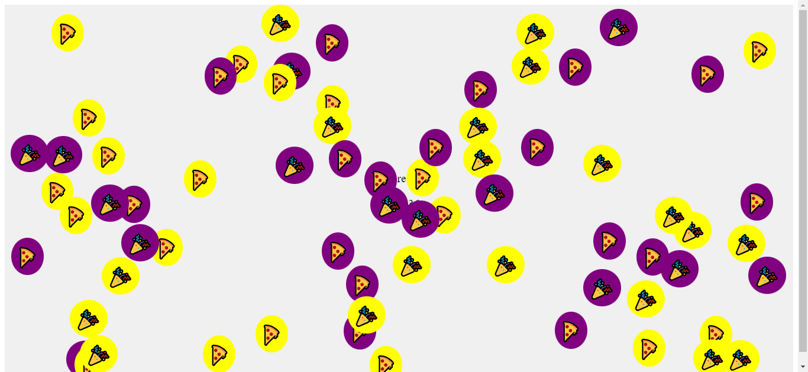

# Bubble Pop Game

<video width="320" height="240" controls>
  <source src="bubble.mp4" type="video/mp4">
  <source src="bubble.ogg" type="video/ogg">
  Your browser does support the video tag.
</video>

Welcome to the Bubble Pop Game, an engaging and entertaining web-based game where your goal is to pop bubbles and score points! Each stage brings new challenges with different symbols and colors for the bubbles.

# How to Play
1. Open the game by visiting the hosted URL (e.g., http://yourdomain.com/path/to/game.html).
2. Click on the bubbles to pop them and score points.
3. As you progress through the stages, you'll encounter bubbles with new symbols and colors.
4. Complete each stage by popping all the bubbles before the time runs out.
Enjoy the game and aim for the highest score!

# Features
1. Multiple Stages: The game offers multiple stages, each with unique symbols and colors for the bubbles, providing an exciting gameplay experience.

2. Interactive Bubbles: Click on the bubbles to pop them, and watch them smoothly disappear with a satisfying popping sound.

3. Stage Completion Sound: Feel accomplished with a cheerful clapping hands sound at the end of each stage.

# Technologies Used
*HTML
*CSS
*JavaScript

# Deployment
To deploy the Bubble Pop Game, follow these steps:

1. Host the HTML, CSS, and JavaScript files on a web server or using a web hosting service.
2. Configure your server or hosting environment to properly serve the files.
3. Access the game by opening the URL where the game is hosted.
4. Share the URL with friends and have fun playing the game!

Enjoy popping bubbles and have a blast playing the Bubble Pop Game! 🎉

